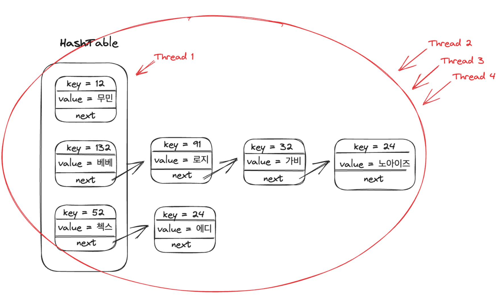
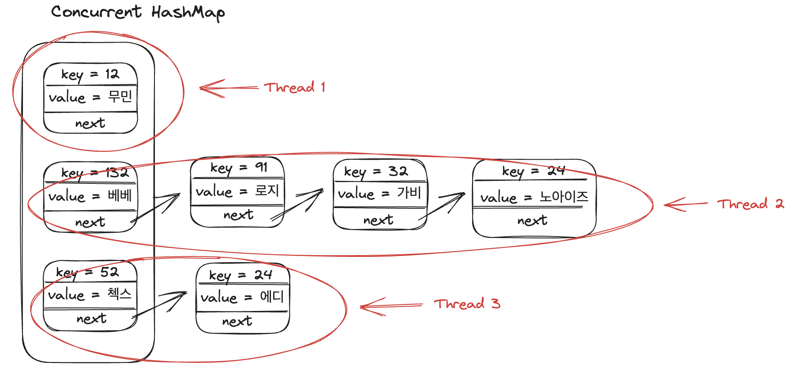

# 포인트 서비스 동시성 제어 분석 보고서

## 1. 동시성 제어 아키텍처 분석

### 1.1 핵심 구성 요소

1) 사용자별 Lock 관리
```java
private final ConcurrentHashMap<Long, ReentrantLock> userLocks = new ConcurrentHashMap<>();
```


- ConcurrentHashMap을 사용하여 thread-safe한 lock 저장소 구현
- Entry 아이템별로 락을 걸어 성능이 HashTable 보다 빠름
- computeIfAbsent() 메서드 사용 (key 값을 userId 기준으로 ReentrantLock 할당)
  -> 사용자별로 독립적인 ReentrantLock 할당으로 다른 사용자 간 간섭 최소화
- Lock 획득/해제가 try-finally 블록으로 안전하게 관리됨
- ReentrantLock은 AbstractQueuedSynchronizer(FIFO) 사용하여 구현되므로 공정성을 확보 가능
-  재진입 가능한 락으로 데드락 방지, 복잡한 동기화 상황에서 유용하게 사용 가능


2) 글로벌 스레드 풀
```java
private final ExecutorService executorService;
...
    this.executorService = Executors.newFixedThreadPool(
    Runtime.getRuntime().availableProcessors()
    );
```

- 서버 환경에 따라 자동으로 최적화된 스레드 수 설정
- 실제 처리할 수 있는 만큼만 스레드 생성하여 시스템 리소스 사용 효율적 관리
- 작업 큐잉을 통한 부하 관리로 순간적인 대량 요청도 안정적으로 처리

3) 작업 실행 메커니즘
```java
private <T> CompletableFuture<T> submitTask(Long userId, Supplier<T> task)
```
- CompletableFuture.supplyAsync()를 사용하여 비동기로 실행하여 결과 생성
  -> Supplier를 통한 지연 실행으로 리소스 효율성 및 작업 결과 반환
  -> 커스텀 ExecutorService를 통한 스레드 관리
  -> Future보다 진화한 형태로 외부에서 작업을 완료시킬 수 있을 뿐만 아니라 콜백 등록 및 Future 조합 등이 가능
- lock 해제가 보장됨

### 1.2 동작 프로세스

1. 요청 접수
- 포인트 충전/사용 요청 접수
- 사용자 ID 기반으로 lock 획득

2. 작업 처리
- 스레드 풀의 작업자 스레드가 처리
- lock 보호 하에 포인트 연산 수행

3. 결과 반환
- 작업 완료 후 lock 해제
- 트랜잭션 결과 히스토리 기록

## 2. 테스트 케이스 분석

### 2.1 단위 테스트 커버리지

1) 기본 기능 검증
- 충전/사용 금액 유효성 검사
- 잔액 제한 검증
- 거래 실패 시나리오 처리
- 히스토리 기록 검증

2) 예외 처리 검증
- 잘못된 금액 입력
- 잔액 부족 상황
- null 데이터 처리

### 2.2 동시성 테스트 결과

1) 동시 충전 테스트
```java
@Test
@DisplayName("동시에 여러 번 충전 시 모든 충전이 정상 처리되어야 함")
```
- 10개 스레드 동시 충전 요청
- 모든 충전이 정상 처리됨
- 최종 잔액이 정확히 계산됨

2) 동시 사용 테스트
```java
@Test
@DisplayName("동시에 여러 번 사용 시 잔액 초과되지 않아야 함")
```
- 잔액 초과 없음 확인
- 실패한 트랜잭션 처리됨

3) 혼합 작업 테스트
```java
@Test
@DisplayName("충전과 사용이 동시에 발생할 때 데이터 정합성 유지")
```
- 충전과 사용 동시 발생
- 데이터 정합성 유지 확인

4) 성능 테스트
```java
@Test
@DisplayName("대량의 동시 요청 처리 성능 테스트")
```
- 100개 동시 요청 처리
- 30초 이내 완료
- 모든 트랜잭션 정상 기록

5) 여러 사용자 테스트
```java
@Test
@DisplayName("서로 다른 사용자의 동시 요청 테스트")
```
- 서로 다른 사용자가 충전을 시도 함
- 데이터 정합성 유지 확인

## 3. 결론

### 3.1 장점
1. 사용자별 독립적 lock으로 처리량 최적화
2. 실패 트랜잭션도 히스토리에 기록되어 추적 가능
3. 안정적인 동시성 제어로 데이터 정합성 보장

### 3.2 성능 특성
1. 동시 처리 능력: 100개 이상의 동시 요청 안정적 처리
2. 응답 시간: 대량 요청도 30초 이내 처리
3. 리소스 사용: 고정 크기 스레드 풀로 효율적 관리

### 3.3 신뢰성
1. 포괄적인 테스트 커버리지
2. 예외 상황 안정적 처리
3. 트랜잭션 추적 가능성 확보
